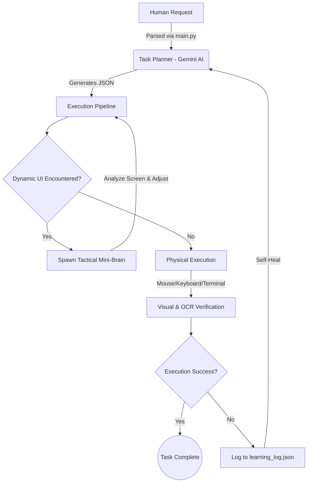

<h1 align="center">🧠 PCIA — Programmable Cognitive Intelligent Agent</h1>

<p align="center">
  <a href="https://github.com/ayrex4/PCIA">
    
  </a>
</p>

<p align="center">
  <em>An experimental autonomous AI that doesn't just chat—it controls your PC.</em>
</p>

<p align="center">
  
  
  
  
</p>

---

## 💡 About the Project

**PCIA** is a cutting-edge **autonomous desktop agent**. Unlike traditional automation tools or chatbots, PCIA acts like a true digital assistant. It bridges the gap between human intent and system execution by combining **Chain-of-Thought Planning**, **Visual UI Verification**, and **Real-Time System Observation**.

Give PCIA a complex task, and it will autonomously use your keyboard, mouse, terminal, and browser to get it done.

---

## 🚀 Quickstart: How to Use PCIA

Ready to let PCIA take the wheel? Follow these steps to get started:

### 1. Clone & Install
```bash
# Clone the repository
git clone https://github.com/ayrex4/PCIA.git
cd PCIA

# Install required dependencies
pip install -r requirements.txt
```

### 2. Environment Setup
Create a `.env` file in the root directory and add your Gemini API key, plus the path to your Tesseract OCR installation:

```env
GEMINI_API_KEY=your_gemini_api_key_here
TESSERACT_CMD_PATH=C:\Program Files\Tesseract-OCR\tesseract.exe
```
*(Note: You must have [Tesseract OCR](https://github.com/UB-Mannheim/tesseract/wiki) installed on your Windows machine).*

### 3. Run the Agent
Start the cognitive engine by running:
```bash
python main.py
```
Type your prompt (e.g., *"Send a high-quality photo of a Porsche 911 to my best friend on WhatsApp"*), hit Enter, and take your hands off the keyboard!

---

## ✨ What's New in Version 0.2?

We've massively upgraded PCIA to be more capable, persistent, and powerful. 

<details>
<summary><b>🖼️ Image Scraping & Delivery</b></summary>
<blockquote>
PCIA can now intelligently search the web, download high-quality images, and physically copy them directly into your chats. <i>(Example: "Send my friend a photo of a car.")</i>
</blockquote>
</details>

<details>
<summary><b>🎵 Spotify Music Control</b></summary>
<blockquote>
Fully integrated ability to search for and play music directly on your desktop Spotify app.
</blockquote>
</details>

<details>
<summary><b>🧠 Persistent Memory</b></summary>
<blockquote>
A new JSON-based memory function allows the agent to learn and remember important details about you and your preferences across sessions.
</blockquote>
</details>

<details>
<summary><b>💻 Direct Terminal Control</b></summary>
<blockquote>
The agent can now safely execute Terminal/CMD commands directly. It can create complex folder structures, manipulate files, or even shut down your laptop upon request!
</blockquote>
</details>

---

## 🧠 How It Works: The Architecture

PCIA uses a multi-layered cognitive architecture to handle unpredictability in desktop environments.



---

## ⚙️ Core Capabilities

- **Self-Healing Execution**: Mistakes happen, but PCIA learns. Execution errors are automatically recorded and injected into the planner so it **never repeats a failure**.
- **Physical Scraping**: Bypassing most anti-bot protections, PCIA uses physical hotkeys (`Ctrl + A`, `Ctrl + C`) to ingest webpage content directly from the browser, exactly like a human would.
- **Context Awareness**: The agent continuously monitors your OS environment (CPU load, RAM usage, open windows) to dynamically adjust its execution timing and maintain stability.

---

## 🛣️ Roadmap: Version 0.3

The next frontier for PCIA is breaking the text barrier. **Version 0.3 will introduce Real-Time Conversation!** 
- **STT & TTS Integration**: You will be able to speak to PCIA directly (Speech-to-Text) and it will reply to you audibly (Text-to-Speech), making it a truly interactive voice assistant for your desktop.

---

## 📊 Project Progress

<div align="center">
  
</div>

Explore the detailed development history in the repository: 👉 **[Insights Tab](https://github.com/ayrex4/PCIA/pulse)**  

---

## 🌐 Connect With Me

<p align="center">
  <a href="mailto:aissaoui.aymane.24@ump.ac.ma">
    
  </a>
  <a href="https://linkedin.com/in/aymane-aissaoui">
    
  </a>
  <a href="https://discord.com/users/phan_tom_7">
    
  </a>
</p>

---

<p align="center">
  ☕ **Turning coffee into code**
</p>
